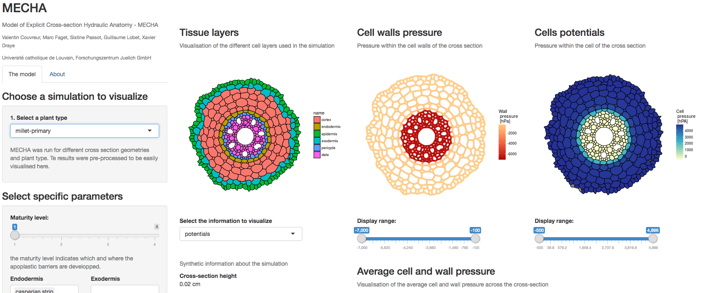

<!-- 
$size: 16:9
page_number: true
footer: Guillaume Lobet || LBRAI2219 || Soil-root-interactions
-->

## **Soil-root interactions** - LBRAI2219

Guillaume Lobet

<small>guillaume.lobet@uclouvain.be</small>

 

Course evaluation: http://bit.ly/lbres2219-eval

---

## Course overview

- Introduction
- Single root anatomy <!-- .element: class="fragment" -->
- Root systems <!-- .element: class="fragment" -->
- What about the soil? <!-- .element: class="fragment" -->
- Roots and water uptake  <!-- .element: class="fragment" -->
	- How do root architecture shape the water uptake? <!-- .element: class="fragment" -->
	- How do the water content shape the root architecture?  <!-- .element: class="fragment" -->

 <i class="fa fa-th" aria-hidden="true"></i> Press "o" for overview  | 
 <i class="fa fa-expand" aria-hidden="true"></i> Press "f" for full screen 

<!---------------------------------------------------->
<!--    	INTRODUCTION   -->
<!---------------------------------------------------->
---

## Introduction

#VSLIDE?image=img/zombie.jpg

# Plants vs animals

+++

### Plants vs animals

<table>
  <tr>
    <th></th>
    <th> Plants </th> 
    <th> Animals </th>
  </tr>
  <tr>
    <td>**Access to food**</td>
    <td>Have to grow more to reach food source</td>
    <td>Move to food source</td>
  </tr>
  <tr class="fragment">
    <td> **Threats** </td>
    <td>Have to face threads</td>
    <td>Move away from threads</td>
  </tr>
  <tr class="fragment">
    <td> **Growth** </td>
    <td>Potentially unlimited</td>
    <td> Limited </td>
  </tr>
  <tr class="fragment">
    <td> **Death** </td>
    <td>Can partially die</td>
    <td> Die </td>
  </tr>  
</table>

+++?image=img/halle-1.jpg

<!---------------------------------------------------->
<!--    	SECTION ABOUT THE SINGLE ROOTS ANATOMY   -->
<!---------------------------------------------------->

---

## Single root anatomy

Axial and radial anatomy of a single root

 <i class="fa fa-arrow-circle-o-down" aria-hidden="true"></i> Press down for details 

+++

#### Root have simple radial and axial anatomy

 

+++

#### Water flow trought the root cylinder

Three different pathways:

- Apoplastic pathway
	- mass movement
	- water potential differences
	- high transpiration (day)

- Symplatic pathway
	- diffusion
	- osmotic differences 
	- low transpiration (night)

- Transcellular pathway	

+++

#### Try out the model

[https://plantmodelling.shinyapps.io/mecha/](https://plantmodelling.shinyapps.io/mecha/)

<!---------------------------------------------------->
<!--    	SECTION ABOUT THE ROOT SYSTEMS    -->
<!---------------------------------------------------->

---

## Root systems

Different types of root systems and how they are built

 <i class="fa fa-arrow-circle-o-down" aria-hidden="true"></i> Press down for details 

+++

#### Root systems are populations of roots

+++?image=img/root-pop.png

+++ 

#### Monocotyledons

+++ 

#### Dicotyledons

+++ 

#### Root production

+++

##### Axial growth

+++

##### Tropisms

+++

##### Branching

+++

##### Integrations

+++

#### Try out the model

[https://plantmodelling.shinyapps.io/shinyRootBox/](https://plantmodelling.shinyapps.io/shinyRootBox/)

<!---------------------------------------------------->
<!--    	SECTION ABOUT THE SOIL   -->
<!---------------------------------------------------->

---

## What about the soil? 

Some basic (but important) soil properties

 <i class="fa fa-arrow-circle-o-down" aria-hidden="true"></i> Press down for details 

<!---------------------------------------------------->
<!--    	SECTION ABOUT THE INTERACTIONS   -->
<!---------------------------------------------------->

---

