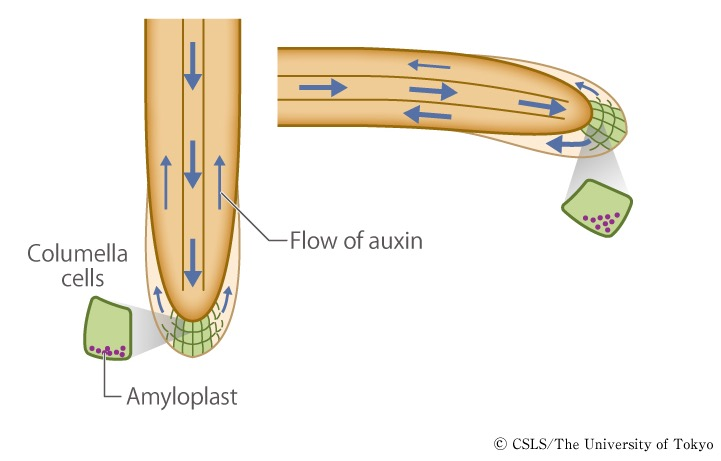
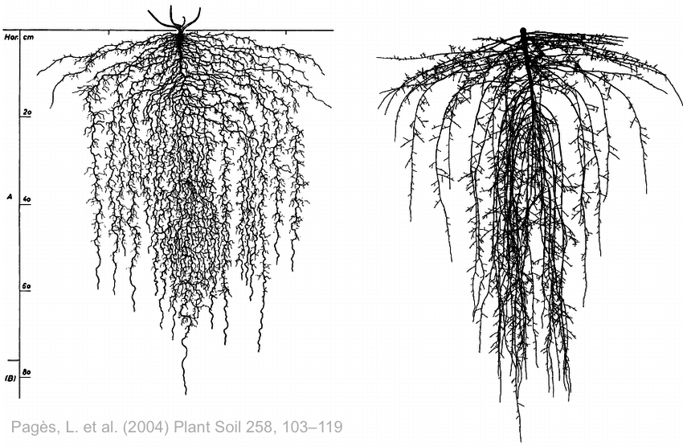
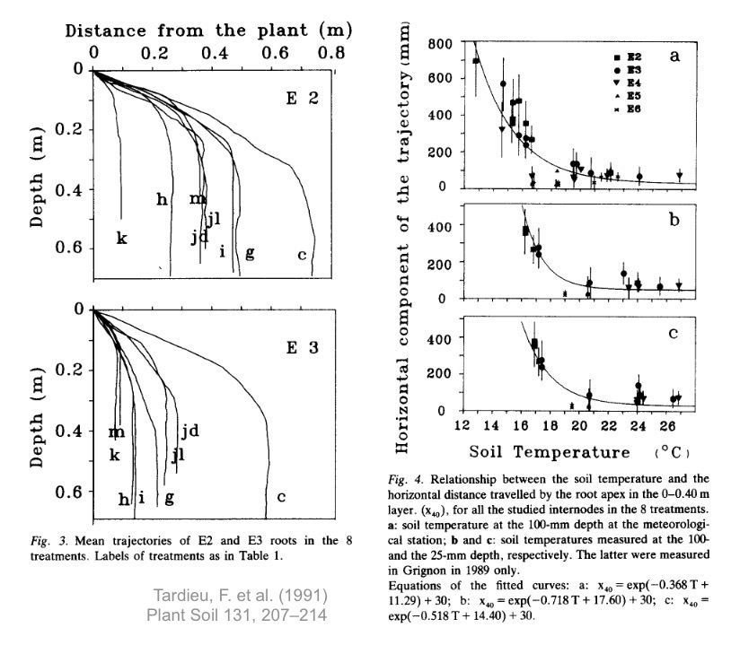
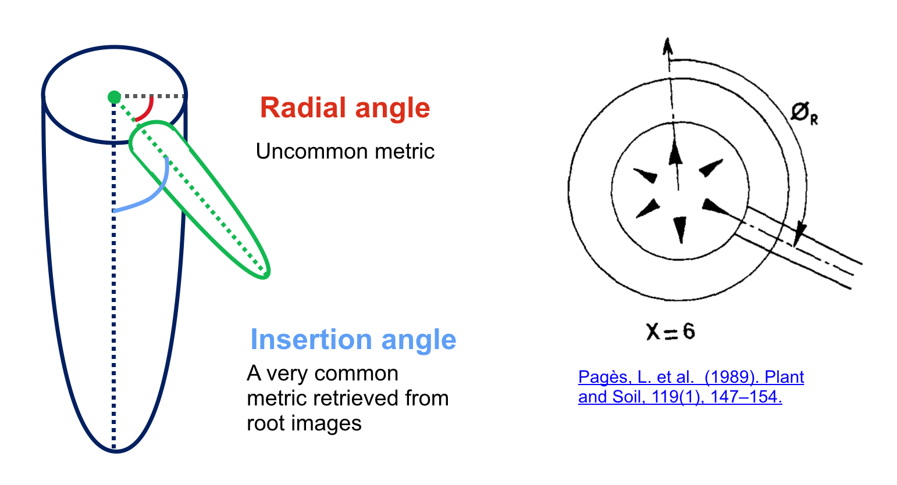
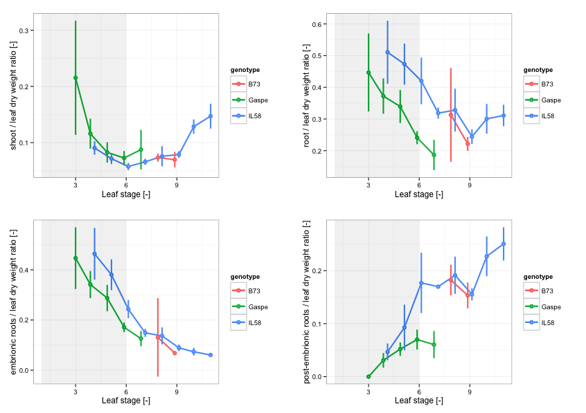
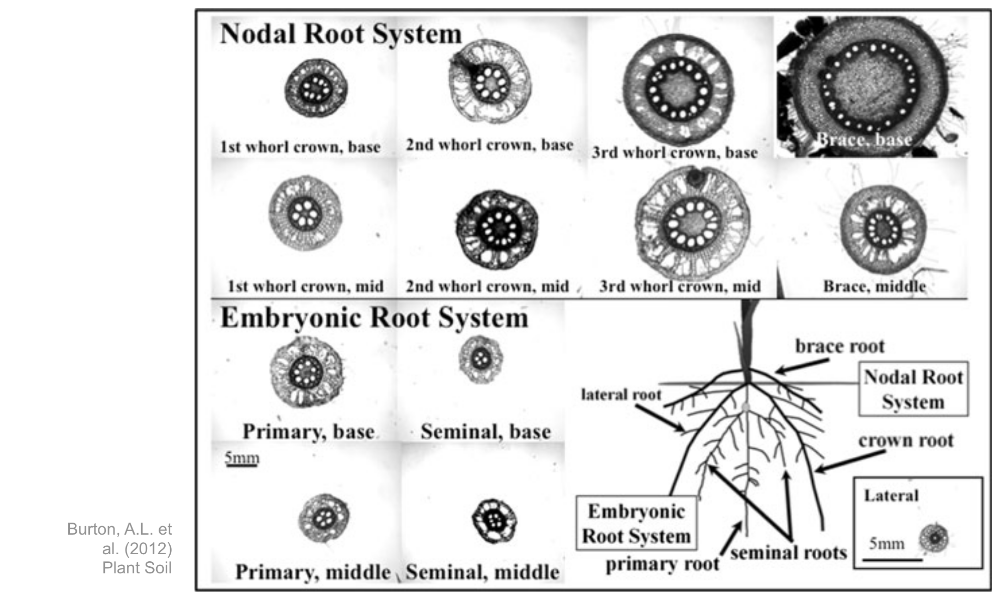

<!-- 
$size: 16:9
page_number: true
footer: Guillaume Lobet || LBRES2106 || Soil-root-interactions
-->

## Soil-root interactions
###LBRES2106

Guillaume Lobet

<small>guillaume.lobet@uclouvain.be</small>

<small><i class="fa fa-twitter" aria-hidden="true" style="color:#1da1f2"></i> @guillaumelobet</small>

---

## About the course

- Course **material** is online: 
	- <i class="fa fa-link" aria-hidden="true"></i> http://bit.ly/LBRES2106

- Collaborative **summary**
	- everybody can take notes in a Google Doc
	- I will correct the summary after each course
	-  <i class="fa fa-link" aria-hidden="true"></i> http://bit.ly/LBRES2106-summary

- Course **evaluation**: 
	- <i class="fa fa-link" aria-hidden="true"></i> http://bit.ly/LBRES2106-eval

--- 

## Course overview

- Introduction
	- Interactions
	- Plants vs animals
	- Some basics about the soil
- Root systems architecture
- Roots and water uptake
	- How do root architecture shape the water uptake? 
	- How do the water content shape the root architecture?

 <i class="fa fa-th" aria-hidden="true"></i> Press "o" for overview  **|**  <i class="fa fa-expand" aria-hidden="true"></i> Press "f" for full screen 

<!---------------------------------------------------->
<!--    	INTRODUCTION   -->
<!---------------------------------------------------->
---

## Introduction

About interactions, soil and animals

 <i class="fa fa-arrow-circle-o-down" aria-hidden="true"></i> Press down for details 

+++?image=img/interactions.jpg

# Interactions

+++

#### *Interaction* can mean different things

- Interactions between compartiments of the system
`$$Plant_t = f(Plant_{t-1}, Soil_t, ...)$$`
`$$Soil_t = f(Soil_{t-1}, Plant_t, ...)$$`
	    
- Interactions between function of the system
	- 	local supply in N <i class="fa fa-arrow-right" aria-hidden="true"></i>
ramification <i class="fa fa-arrow-right" aria-hidden="true"></i>
local K upake

- Non-additivity ot single (or multiple factors)
	- effect of new dose of a given factor is variable between dose, species, developmental stages, ...
	- effect depend on the environment	

+++

#### Example of effect of single nutrient supply on root architecture

+++

#### Example of multiple nutrient supply on root architecture

+++?image=img/zombie.jpg

# Plants vs animals

+++

<table>
  <tr>
    <th></th>
    <th> Plants </th> 
    <th> Animals </th>
  </tr>
  <tr class="fragment">
    <td>**Food source**</td>
    <td class="fragment">Autotroph</td>
    <td class="fragment">Heterotroph</td>
  </tr>
  <tr class="fragment">
    <td>**Access to food**</td>
    <td class="fragment">Have to grow more to reach food source</td>
    <td class="fragment">Move to food source</td>
  </tr>
  <tr class="fragment">
    <td> **Growth** </td>
    <td class="fragment">Potentially unlimited</td>
    <td class="fragment"> Limited </td>
  </tr>
  <tr class="fragment">
    <td> **Environment** </td>
    <td class="fragment">Highly heterogeneous</td>
    <td class="fragment"> Mostly homogeneous </td>
  </tr>  
  <tr class="fragment">
    <td> **Death** </td>
    <td class="fragment">Can partially die</td>
    <td class="fragment"> Die </td>
  </tr>  
</table>

+++?image=img/halle-1.jpg

+++?image=img/maize-field.JPG

## Space heterogeneity: soil vs atmosphere

+++

# Some basics about the soil

+++?image=img/root-soil.jpg

+++

### Vertical heterogeneity in the soil

+++

### Horizontal heterogeneity in the soil

+++

### Time heterogeneity in the soil

+++

### Root environment = Rhizosphere

+++

### Ion movement in the soils

+++

### Water movement in the soils

+++

### The soil is complex medium

+++

### Soil retention curve

+++

### Soil conductivity curve

+++

#### Soil is:

- complex media
	- different particule sizes
	- different physico-chemical properties
- highly heterogeneous
	- verticaly
	- horizontaly
	- in time
- non linear behaviour

<!---------------------------------------------------->
<!--    	SECTION ABOUT THE ROOT SYSTEMS    -->
<!---------------------------------------------------->

---

## Root systems

Different types of root systems and how they are built

 <i class="fa fa-arrow-circle-o-down" aria-hidden="true"></i> Press down for details 

+++

#### Root have simple radial and axial anatomy

+++ 

#### The root radial anatomy is relativelly conserved accross species

+++?image=img/root-pop.png

## Root systems are populations of roots

+++

#### Root age distribution in Crypsis aculeata

+++ 

#### Root nomenclature

+++ 

#### Monocots vs dicots

| | Monocot | Dicot|
| ------- | -------- | -------- |
| **Type** | fasciculated | herring-bone|
| **Seminals** | yes | no |
| **Adventitous roots** | yes | (yes) |
| **Secondary growth** | no | yes |
 
 

+++ 

#### Monocots vs dicots 

+++

#### Complex root architecture arise from a limited number of simple processes

1. Root production
2. Root axial growth
3. Root tropisms
4. Root branching

+++

## Root production

+++

##### In monocots, root production (order 0) depend on the node /tiller formation

+++

##### Root production = f(environment)

Light interception, temeprature, soil strenght, nutrients, ...

+++

## Growth

+++

#### Axial growth

Simple process at the single root scale:

1. Cells production
2. Cells division
3. Cells elongation

+++

+++ 

##### The meristem is region of important metabolic activity

- Water uptake
- Carbon consumption
- Exudation
- ...

+++

##### Growth rate is not always constant

+++

##### Growth rate is not always constant

+++

##### Growth as a function of diameter ?

+++
## Tropisms

+++

##### Tropisms = growth re-direction

+++

##### Different type of tropisms in roots

- **Gravitropism**
	- toward the center of the Earth
- **Chemiotropism**
	- toward an increasing concentration in a specific nutrient
- **Hydrotropism**
	- toward increasing water potential values
- Tropisms change with
	- root types
	- root ages
	- environment conditions
	- 

+++

##### Gravitropism = f(root age)

+++

##### Gravitropism = f(soil temp)

+++

## Root branching

+++

##### Branching

+++

##### Lateral roots emerge with a given angle

+++

##### Lateral roots represent a large proportion of the total root system

+++

##### The parent root can be divided in different regions

- Basal zone
- Branched zone
- Apical zone

+++

+++

##### LAUZ = f(growth)

LAUZ = Length of Apical Unbranched Zone

+++

## Integrations

+++

##### Different strategies

- Dicots
	- [x,y] exploration -> lateral roots
	- [z] exploration -> primary axis
	- secondary growth -> large number of laterals
	- Axes stop growing -> stay alive
- Monocots
	- [x,y,z] exploration -> primary axis (nodals)
	- no secondary growth -> limited number of laterals
	- Axes stop growing -> reduce the branching region
	- nodal root production stops at flowering

+++

##### Root have a cost

- Different costs:
	- production
	- maintenance
	- exudation

+++

##### Root / shoot allocation

+++

##### Reducing maintenance cost -> Aerenchyma

+++

##### Modelling root system architectures - 1

+++

##### Modelling root system architectures - 2

+++

#### Try out the model

[https://plantmodelling.shinyapps.io/shinyRootBox/](https://plantmodelling.shinyapps.io/shinyRootBox/)

#### Exercices

1. Choose a plant species
1. Maxime exploration and reduce cost
2. Maxime uptake of a top-layer, immobile ressource
3. Maxime uptake of a mobile ressource

<!---------------------------------------------------->
<!--    	SECTION ABOUT THE INTERACTIONS   -->
<!---------------------------------------------------->

---

## How do root architecture shape water uptake?

About root hydraulic architecture, root density profile and drought

 <i class="fa fa-arrow-circle-o-down" aria-hidden="true"></i> Press down for details 

+++

#### Root process and water uptake

#### Water flow trought the root cylinder

+++

#### Three pathways

- Apoplastic pathway
	- mass movement
	- water potential differences
	- high transpiration (day)

- Symplatic pathway
	- diffusion
	- osmotic differences 
	- low transpiration (night)

- Transcellular pathway	

+++

<!---------------------------------------------------->
<!--    	SECTION ABOUT THE INTERACTIONS   -->
<!---------------------------------------------------->

---

## How do water uptake affect root architecture?

+++

#### Hydro-patterning

