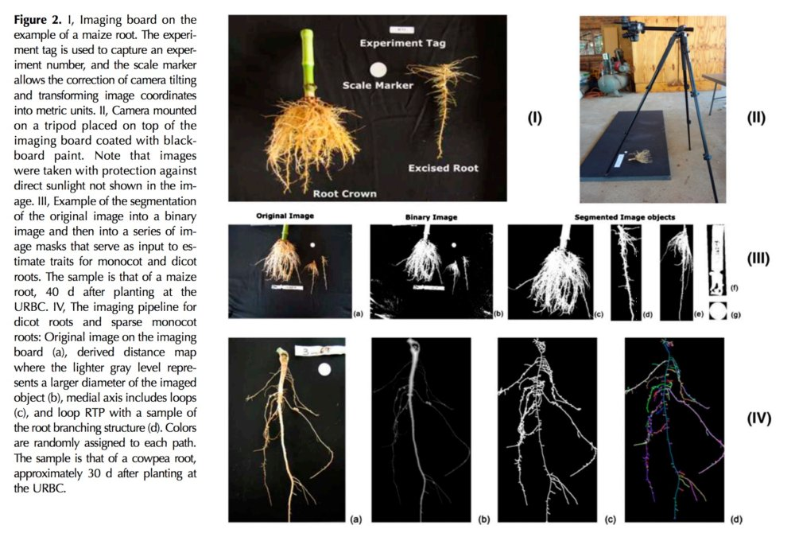

<!-- 
$size: 16:9
page_number: true
footer: Guillaume Lobet || LBRES2106 || Soil-root-interactions
-->

## Soil-root interactions
###LBRES2106

Guillaume Lobet

<small>guillaume.lobet@uclouvain.be</small>

<small><i class="fa fa-twitter" aria-hidden="true" style="color:#1da1f2"></i> @guillaumelobet</small>

---

## About the course

- Course **material** is online: 
	- <i class="fa fa-link" aria-hidden="true"></i> http://bit.ly/LBRES2106

- Collaborative **summary**
	- Everybody can take notes in a Google Doc
	- I will correct the summary after each course
	-  <i class="fa fa-link" aria-hidden="true"></i> http://bit.ly/LBRES2106-2018

- Course **evaluation**: 
	- <i class="fa fa-link" aria-hidden="true"></i> http://bit.ly/LBRES2106-eval-2018

--- 

### Editing in Google Docs

Use the Suggestion Mode

--- 

## Course overview

- Introduction
- Root systems architecture
	- Different types of root systems and how they are built
- How do roots shape the water uptake ? 
	- About root hydraulic architecture, density profiles and drought
- How does the soil shape the roots ?
	- About tropism, soil strenght and hydropatterning
- How can we observe roots ?
	- About phenotyping and experimental setup

 <i class="fa fa-th" aria-hidden="true"></i> Press "o" for overview  **|**  <i class="fa fa-expand" aria-hidden="true"></i> Press "f" for full screen 

+++

###  Contribution de l'activité au référentiel AA [1/2]

- Connaître et comprendre un socle de savoirs scientifiques dans le domaine des ressources en eaux et en sols (M1.2)

- Mobiliser des savoirs en ingénierie de manière critique face à un problème complexe dans le domaine de l'environnement, en intégrant des processus à différentes échelles allant du minéral et de l'organisme vivant jusqu'au paysage (M1.4, M2.4)

- Résumer un état des connaissances sur une problématique de recherche complexe en continuité avec ses choix de spécialisation (M3.1)

+++

###  Contribution de l'activité au référentiel AA [2/2]

- Analyse selon une approche systémique et multidisciplinaire une problématique complexe d'ingénierie dans le domaine de l'environnement (M4.3)

- Comprendre et exploiter des articles scientifiques et documents techniques avancés (M6.1)

 
+++

### Formulation spécifique pour cette activité des AA du programme [1/2]

A la fin de cette activité, l'étudiant est capable :

- d'appréhender les interactions sol-plante à l'échelle du champ cultivé pour mieux gérer le système de culture et ses impacts sur le sol et la plante

- de percevoir la dynamique des interactions sol-plante, en référence au fonctionnement des sols cultivés et aux stratégies d'exploration et d'exploitation du sol par la plante

+++

### Formulation spécifique pour cette activité des AA du programme [2/2]

- d'interpréter les réponses de la plante à son environnement et aux intrants, et l'impact du système de culture sur le sol

- d'envisager la gestion de la fertilité dans un cadre systémique respectueux de l'environnement, via l'adoption d'itinéraires techniques ad hoc et le monitoring du système de culture

+++

### Cursus plante 

<!------------------------------------------------------------------------>
<!--    	SECTION ABOUT THE EFFECT OF ROOTS ON THE SOIL WATER CONTENT   -->
<!------------------------------------------------------------------------>

---

## How can we observe roots?

About phenotyping and experimental setups

 <i class="fa fa-arrow-circle-o-down" aria-hidden="true"></i> Press down for details 

+++

#### Phenotyping platforms

+++

#### Petri dishes

+++

#### Pouches

+++

#### Gellan Gum

+++

#### Aeroponics

+++

#### Aeroponics

+++

#### Hydroponics

+++

#### Rhizoponics

+++

#### Transparent soil

+++

#### Transparent soil

+++

#### Rhizotrons

+++

#### Rhizotrons

+++

#### GLO-Root

+++

#### GLO-Root

+++

#### X-Ray / MRI

+++

#### X-Ray / MRI

+++

#### X-Ray / MRI

+++

#### Shovelomics

+++

#### Trenches

+++

#### Mini-rhizotrons

