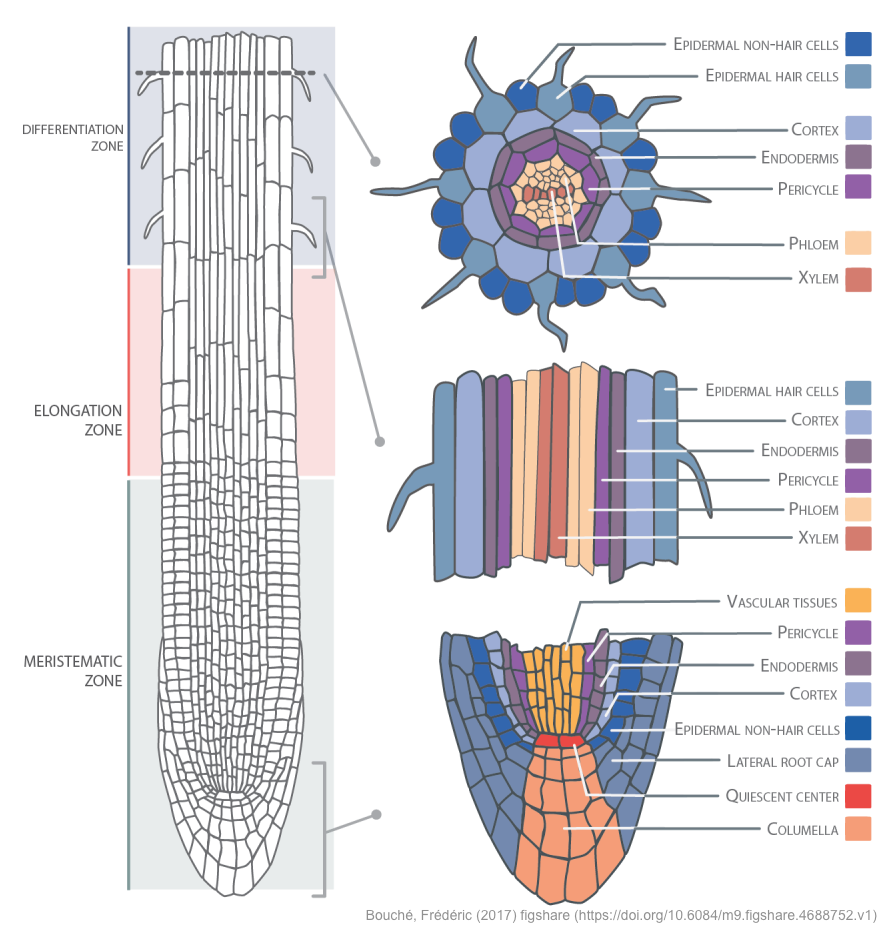
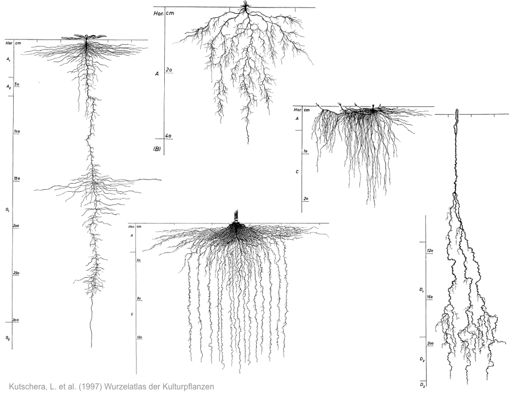

<!-- 
$size: 16:9
page_number: true
footer: Guillaume Lobet || LBRAI2219 || Soil-root-interactions
-->

## **Soil-root interactions** - LBRAI2219

  

Guillaume Lobet

<small>guillaume.lobet@uclouvain.be</small>

 

Course evaluation: http://bit.ly/lbres2219-eval

---

## Course overview

- What are roots and how do they form root systems
- What is the soil? 
- Roots and water uptake
	- How do root architecture shape the water uptake?
	- How do the water content shape the root architecture? 

---

## Single root anatomy

Axial and radial anatomy of a single root

 <i class="fa fa-arrow-circle-o-down" aria-hidden="true"></i> Press down for details 

<small>[Bouché, Frédéric (2017) figshare](https://doi.org/10.6084/m9.figshare.4688809.v1)</small>

+++

#### Root have simple radial and axial anatomy

 

<small>[Bouché, Frédéric (2017) figshare](https://doi.org/10.6084/m9.figshare.4688809.v1)</small>

+++

## Water flow trought the root cylinder

Examples unsing the MECHA model

---

## Root systems

Different types of root systems and how they are built

 <i class="fa fa-arrow-circle-o-down" aria-hidden="true"></i> Press down for details 

[Bouché, Frédéric (2017) figshare](https://doi.org/10.6084/m9.figshare.4688809.v1)

+++

#### Root systems are populations of roots

Kutschera, L. et al. (1997) Wurzelatlas der Kulturpflanzen

+++ 

#### Monocotyledons

+++ 

#### Dicotyledons

+++ 

#### Root production

+++

##### Axial growth

+++

##### Tropisms

+++

##### Branching

+++

#####

