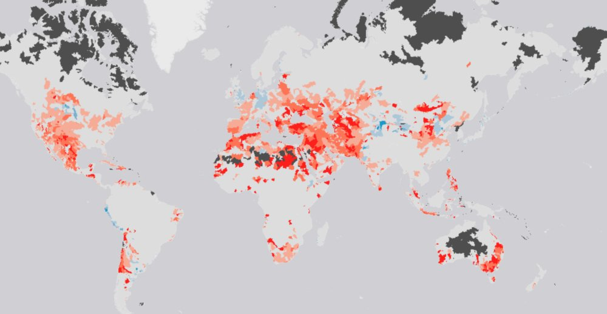

<!-- 
$size: 16:9
page_number: true
footer: Guillaume Lobet || LBRES2106 || Soil-root-interactions
-->

## Soil-root interactions
###LBRES2106

Guillaume Lobet

<small>guillaume.lobet@uclouvain.be</small>

<small><i class="fa fa-twitter" aria-hidden="true" style="color:#1da1f2"></i> @guillaumelobet</small>

---

## About the course

- Course **material** is online: 
	- <i class="fa fa-link" aria-hidden="true"></i> http://bit.ly/LBRES2106

- Collaborative **summary**
	- Everybody can take notes in a Google Doc
	- I will correct the summary after each course
	-  <i class="fa fa-link" aria-hidden="true"></i> http://bit.ly/LBRES2106-2019

- Course **evaluation**: 
	- <i class="fa fa-link" aria-hidden="true"></i> http://bit.ly/LBRES2106-eval-2019

--- 

### Editing in Google Docs

Use the Suggestion Mode

--- 

## Course overview

- Introduction
- Root systems architecture
	- Different types of root systems and how they are built
- How do roots shape the water uptake ? 
	- About root hydraulic architecture, density profiles and drought
- How does the soil shape the roots ?
	- About tropism, soil strenght and hydropatterning
- How can we observe roots ?
	- About phenotyping and experimental setup

 <i class="fa fa-th" aria-hidden="true"></i> Press "o" for overview  **|**  <i class="fa fa-expand" aria-hidden="true"></i> Press "f" for full screen 

+++

###  Contribution de l'activité au référentiel AA [1/2]

- Connaître et comprendre un socle de savoirs scientifiques dans le domaine des ressources en eaux et en sols (M1.2)

- Mobiliser des savoirs en ingénierie de manière critique face à un problème complexe dans le domaine de l'environnement, en intégrant des processus à différentes échelles allant du minéral et de l'organisme vivant jusqu'au paysage (M1.4, M2.4)

- Résumer un état des connaissances sur une problématique de recherche complexe en continuité avec ses choix de spécialisation (M3.1)

+++

###  Contribution de l'activité au référentiel AA [2/2]

- Analyse selon une approche systémique et multidisciplinaire une problématique complexe d'ingénierie dans le domaine de l'environnement (M4.3)

- Comprendre et exploiter des articles scientifiques et documents techniques avancés (M6.1)

 
+++

### Formulation spécifique pour cette activité des AA du programme [1/2]

A la fin de cette activité, l'étudiant est capable :

- d'appréhender les interactions sol-plante à l'échelle du champ cultivé pour mieux gérer le système de culture et ses impacts sur le sol et la plante

- de percevoir la dynamique des interactions sol-plante, en référence au fonctionnement des sols cultivés et aux stratégies d'exploration et d'exploitation du sol par la plante

+++

### Formulation spécifique pour cette activité des AA du programme [2/2]

- d'interpréter les réponses de la plante à son environnement et aux intrants, et l'impact du système de culture sur le sol

- d'envisager la gestion de la fertilité dans un cadre systémique respectueux de l'environnement, via l'adoption d'itinéraires techniques ad hoc et le monitoring du système de culture

+++

### Cursus plante 

<!---------------------------------------------------->
<!--    	INTRODUCTION   -->
<!---------------------------------------------------->
---

## Introduction

About roots, world status, interactions, soil and animals

 <i class="fa fa-arrow-circle-o-down" aria-hidden="true"></i> Press down for details 

+++

## Roots?

+++?image=small_img/carrot.jpg

+++?image=small_img/cassava.jpg

+++?image=small_img/potato.jpg

+++?image=small_img/sugar_beet.jpg

+++?image=small_img/oca.jpg

+++

### Tuber and roots - World production

+++?image=small_img/Switchgrass_roots.jpg

+++?image=small_img/maize_root.jpg

+++?image=small_img/wheat_root.jpg

+++

### Carbon sequestration in soil

+++

## Our current (and future) world

+++

### Water in the world

+++

### Status in 2040

+++

### Status in Europe in 2040

+++

### Increase in variability

+++?image=small_img/interactions.jpg

# Interactions

+++

#### *Interaction* can mean different things

- Interactions between compartiments of the system
`$$Plant_t = f(Plant_{t-1}, Soil_t, ...)$$`
`$$Soil_t = f(Soil_{t-1}, Plant_t, ...)$$`
	    
- Interactions between function of the system
	- 	local supply in N <i class="fa fa-arrow-right" aria-hidden="true"></i>
ramification <i class="fa fa-arrow-right" aria-hidden="true"></i>
local K upake

- Non-additivity ot single (or multiple factors)
	- effect of new dose of a given factor is variable between dose, species, developmental stages, ...
	- effect depend on the environment	

+++

#### Example of effect of single nutrient supply on root architecture

+++

#### Example of multiple nutrient supply on root architecture

+++?image=small_img/zombie.jpg

# Plants vs animals

+++

<table>
  <tr>
    <th></th>
    <th> Plants </th> 
    <th> Animals </th>
  </tr>
  <tr class="fragment">
    <td>**Food source**</td>
    <td class="fragment">Autotroph</td>
    <td class="fragment">Heterotroph</td>
  </tr>
  <tr class="fragment">
    <td>**Access to food**</td>
    <td class="fragment">Have to grow more to reach food source</td>
    <td class="fragment">Move to food source</td>
  </tr>
  <tr class="fragment">
    <td> **Growth** </td>
    <td class="fragment">Potentially unlimited</td>
    <td class="fragment"> Limited </td>
  </tr>
  <tr class="fragment">
    <td> **Environment** </td>
    <td class="fragment">Highly heterogeneous</td>
    <td class="fragment"> Mostly homogeneous </td>
  </tr>  
  <tr class="fragment">
    <td> **Death** </td>
    <td class="fragment">Can partially die</td>
    <td class="fragment"> Die </td>
  </tr>  
</table>

+++?image=small_img/halle-1.jpg

+++?image=small_img/lamarck.jpg
## Animals do not adapt to their environment

+++?image=small_img/temple.jpg
## Plants do adapt to their environment

+++?image=small_img/maize-field.jpg

## Space heterogeneity: soil vs atmosphere

+++

# Some basics about the soil

+++?image=small_img/root-soil.jpg

+++

### Vertical heterogeneity in the soil

+++

### Horizontal heterogeneity in the soil

+++

### Time heterogeneity in the soil

+++

### Root environment = Rhizosphere

+++

### Ion movement in the soils

+++

### Water movement in the soils

+++

### The soil is complex medium

+++

### Soil retention curve

<small>Source: <a href="http://www.tankonyvtar.hu/en/tartalom/tamop425/0032_talajtan/ch07s05.html">http://www.tankonyvtar.hu/en/tartalom/tamop425/0032_talajtan/ch07s05.html</a></small>

+++

### Soil conductivity curve

+++

#### Soil is:

- complex media
	- different particule sizes
	- different physico-chemical properties
- highly heterogeneous
	- verticaly
	- horizontaly
	- in time
- non linear behaviour

